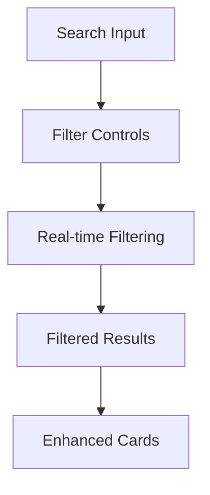
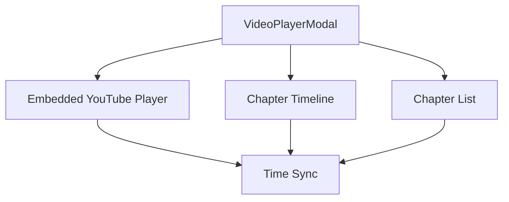

# Video Analysis UX/UI Enhancement Plan

## 📋 Project Overview

This document outlines the comprehensive plan to enhance the `/video-analizi` page and homepage analysis cards with improved UX/UI, search functionality, embedded videos, and mobile responsiveness.

## 🎯 Current State Analysis

### Video Analysis Page (`/video-analizi`)
- ✅ Basic YouTube URL input and analysis
- ✅ Embedded YouTube player with chapter navigation
- ✅ Analysis history display
- ❌ No search/filter functionality for history
- ❌ Limited mobile optimization
- ❌ Basic card design without embedded videos

### Homepage Analysis Cards
- ✅ Shows analysis results in accordion format
- ✅ Basic thumbnail display
- ❌ No embedded video functionality
- ❌ No clickable chapter popups
- ❌ Limited interactivity

## 🏗️ Architectural Improvements

### 1. Enhanced Search & Filter System

**Features:**
- Real-time search through analysis history
- Filter by video title, channel, or chapter content
- Date range filtering
- Sort options (newest, oldest, relevance)
- Clear filters functionality

### 2. Reusable Video Player Component

**Components:**
- `VideoPlayerModal.js` - Main modal component
- `ChapterTimeline.js` - Interactive timeline
- `ChapterList.js` - Clickable chapter list
- `VideoEmbed.js` - Responsive YouTube embed

### 3. Enhanced Card Components

**Video Analysis History Cards:**
- Embedded YouTube player (click to play)
- Hover effects with preview
- Chapter count badges
- Quick action buttons
- Mobile-optimized layout

**Homepage Analysis Cards:**
- Replace static thumbnails with embedded videos
- Add chapter popup functionality
- Consistent design language
- Improved accessibility

## 📱 Mobile-First Responsive Design

### Breakpoint Strategy
- **Mobile (< 768px):** Single column, touch-optimized
- **Tablet (768px - 1024px):** Two columns, hybrid interaction
- **Desktop (> 1024px):** Three columns, full features

### Touch Interactions
- Larger tap targets (minimum 44px)
- Swipe gestures for chapter navigation
- Pull-to-refresh for history updates
- Optimized video controls

## 🎨 UI/UX Enhancements

### Visual Improvements
- Consistent color scheme with brand colors (#177267, #ffc574)
- Smooth animations and transitions
- Loading states and skeletons
- Error handling with user-friendly messages

### Interaction Patterns
- Progressive disclosure for complex features
- Contextual tooltips and help text
- Keyboard navigation support
- Screen reader compatibility

## 🔧 Technical Implementation Strategy

### New Components to Create

1. **`SearchFilterBar.js`** - Unified search and filter interface
2. **`VideoAnalysisCard.js`** - Enhanced card with embedded video
3. **`ChapterNavigationModal.js`** - Popup for chapter navigation
4. **`VideoPlayerWithChapters.js`** - Integrated player component
5. **`MobileVideoControls.js`** - Touch-optimized controls

### API Enhancements
- Client-side filtering for better performance
- Optimized data fetching with pagination
- Caching strategy for video metadata

### State Management
- Local state for UI interactions
- Persistent filters in localStorage
- Optimistic updates for better UX

## 🚀 Implementation Phases

### Phase 1: Core Infrastructure
- [x] Analyze current functionality
- [ ] Create reusable video player components
- [ ] Implement search and filter functionality
- [ ] Update video analysis page layout

### Phase 2: Enhanced Interactions
- [ ] Add embedded videos to cards
- [ ] Implement chapter popup modals
- [ ] Mobile optimization

### Phase 3: Polish & Performance
- [ ] Animation and transition improvements
- [ ] Performance optimization
- [ ] Accessibility enhancements
- [ ] Cross-browser testing

## 📊 Success Metrics

- **User Engagement:** Increased time spent on video analysis pages
- **Mobile Usage:** Improved mobile conversion and interaction rates
- **Feature Adoption:** Usage of new chapter navigation and search features
- **Performance:** Faster load times and smoother interactions

## 🎯 Key Benefits

1. **Improved Discoverability:** Search and filter make finding specific analyses easier
2. **Enhanced Engagement:** Embedded videos and interactive chapters increase user interaction
3. **Mobile Excellence:** Touch-optimized design improves mobile experience
4. **Consistent UX:** Unified design language across homepage and analysis pages
5. **Accessibility:** Better support for users with disabilities

## 🔄 Next Steps

1. Design and implement search filter component
2. Create enhanced video analysis cards
3. Develop chapter navigation modal
4. Implement mobile-responsive design
5. Update homepage analysis cards
6. Test and optimize user experience

---

*This plan provides a comprehensive roadmap for transforming the video analysis experience while maintaining existing functionality and improving upon it significantly.*